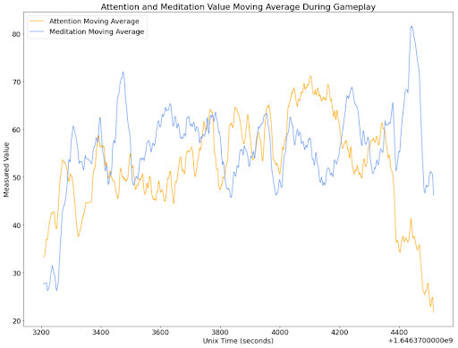

# One-With-The-Force

This project performs an online EEG analysis to add an additional challenge to an existing Star Wars game called Star Wars Jedi: Fallen Order. This will allow for better alignment with how Star Wars abilities are portrayed in the movies. This will also serve as a proof of concept for potential future game control development to add an additional layer of engagement for the players.

# [Demo](OneWithTheForceDemo.mp4)

# The Brain Computer Interface (BCI)

# Data Analysis
